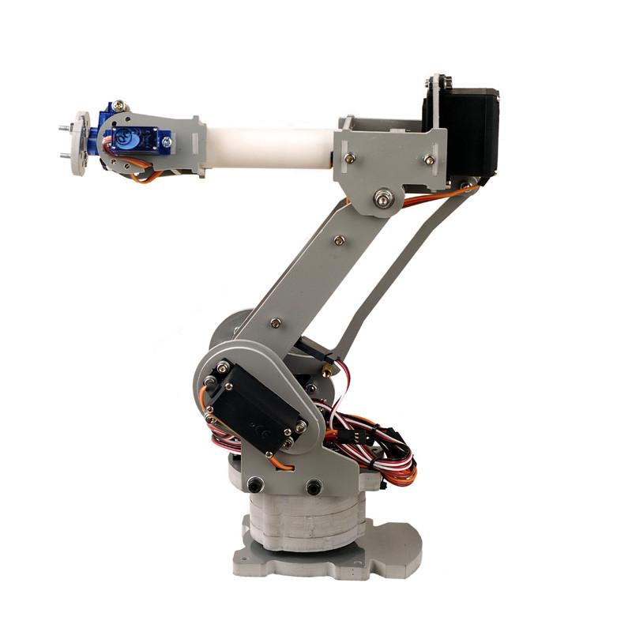
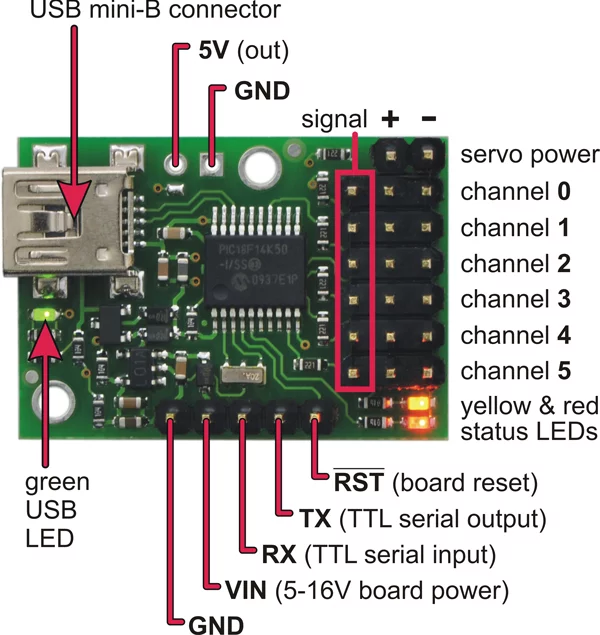
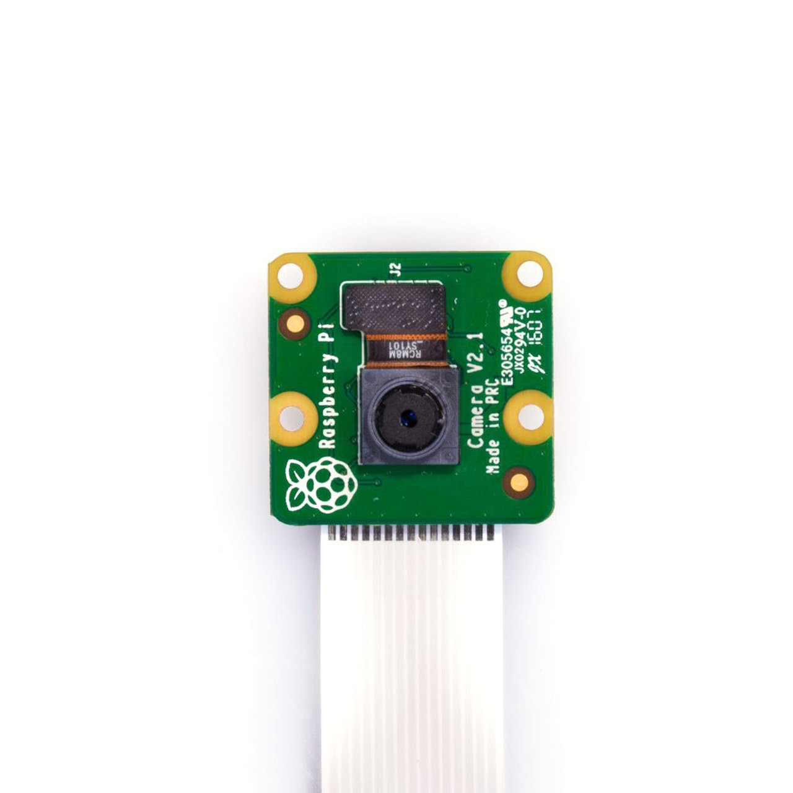
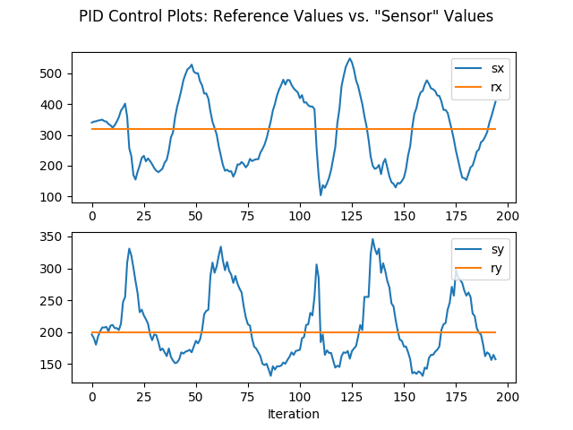
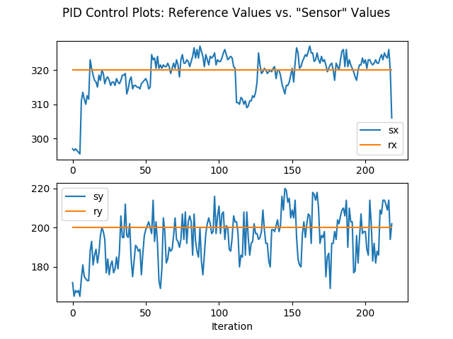
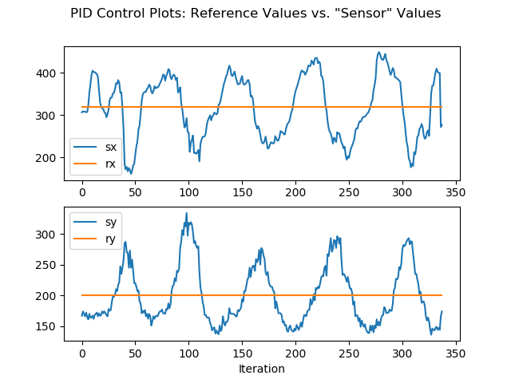
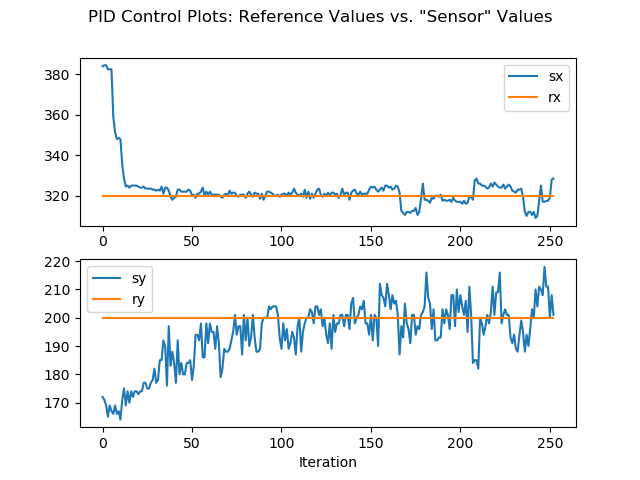

# Raspberry Pi Performance Testing using Computer Vision
Project for ME 399: Independent Study, Summer 2019. Advisor: Nick Marchuk.

## Overview
This project aimed to test the performance of the two latest Raspberry Pi models at the time: the Pi 3 Model B+ and the Pi 4 Model B. This consisted of running a program on both Pi models and comparing the way the program executed. For this project, the program of choice was a face detection algorithm that also commanded a robot arm's movement to follow a person's face in two directions using PI control. Performance testing involved observing how the program ran, outputting time data, and plotting the control system’s performance.

## Hardware
A SainSmart 6-Axis Desktop Robotic Arm was used alongside a Polulu Micro Maestro 6-channel USB Servo Controller. The controller has 6 connections for servos and can be powered by USB or a 5-16V pin input. The servos themselves were powered by a laptop charger (their cables were soldered to the charger).





For vision, a Raspberry Pi camera was attached to the end effector of the robot arm.



## Software
### Dependencies
- The OpenCV Python library was used for face detection. Its `cv2.CascadeClassifier` class uses a Haar Cascade to detect faces.
- [This repo](https://github.com/FRC4564/Maestro) contains a file called `maestro.py` which utilizes Python’s serial module (pySerial) to communicate with the Maestro controller.

### Workflow
In a nutshell, the code detects faces and uses the x,y distance of the faces to the midpoint of the video feed to send a signal to two of the robot arm's servos. The servos try to correct the position discrepancy by moving the robot until the face lies in the midpoint of the image.

### Pseudocode
1. Initialize all servos to a home position.
2. Initialize controller variables.
3. While true:
   1. Detect faces and draw face rectangles using `detectMultiScale` function.
   2. For each face:
      1. Initialize reference value (midpoint of window) and sensor value (midpoint of face rectangle) for both x and y directions.
      2. Acquire position error (distance between midpoint of window and midpoint of rectangle) for both x and y directions.
      3. Feed position targets (which depend on position error) to the servos that control x,y movement.
4. If break signal is detected, plot error results.

### Setup and Usage
1. After installing OpenCV and pySerial, download the `maestro.py` module:
   ```
   wget https://raw.githubusercontent.com/FRC4564/maestro/master/maestro.py
   ```
2. All code resides in `code/main.py`. Simply run:
   ```
   python main.py
   ```

## Testing
Two tests were conducted to measure the performance of each Raspberry Pi model: the transient response test and the steady state response test. The former involved the user moving around in circles (so x and y coordinates are constantly changing) and analyzing how well the robot keps up with the motion. The steady state test involved the user staying at a fixed position and analyzing how well the robot adapts to the position of the user on the long run.

## Demos
- [Face-following demo.](https://youtu.be/GWdoHlCjZsU)
- [RasPi 3 transient response test.](https://youtu.be/AGC2xwxjNNM)
- [RasPi 3 steady state response test.](https://youtu.be/l2Q4CM-DJ3g)
- [RasPi 4 transient response test.](https://youtu.be/Ocle1fLOTH8)
- [RasPi 4 steady state response test.](https://youtu.be/cDEksCJzUOU)

## Results and Analysis
- RasPi 3 transient response test:
  <br>
  
- RasPi 3 steady state response test:
  <br>
  
- RasPi 4 transient response test:
  <br>
  
- RasPi 4 steady state response test:
  <br>
  
  
The Raspberry Pi 4 provides significantly more speed and precision when performing the project's code than the Raspberry Pi 3. 

With regards to transient performance, the Pi 3 has peak-to-peak sensor values of about 400 and 200 for sx and sy, respectively. Meanwhile, the Pi 4 has about 200 and 150. This is a significant reduction in range, especially for sx, which displayed a reduction of 50%.

Regarding steady state performance, the Pi 4 comes out on top again. The Pi 4 had a nearly perfect performance for sx, and showed a peak-to-peak of around 25 for sy while the Pi 3 had almost 40.

These tests provide great quantitative insight on the difference in Pi models, but there is also much to be discussed when it comes to qualitative analysis. The Pi3 had significant visual lag between events in real life and events captured by the camera when compared to the Pi 4. In other words, the Pi 3's camera footage was delayed, causing the robot to naturally follow a slower trajectory. This is also shown in the Pi 3's graphs, as the peaks are wider than the Pi 4's due to the slower response. The Pi 4 was much more crisp and responsive. 
